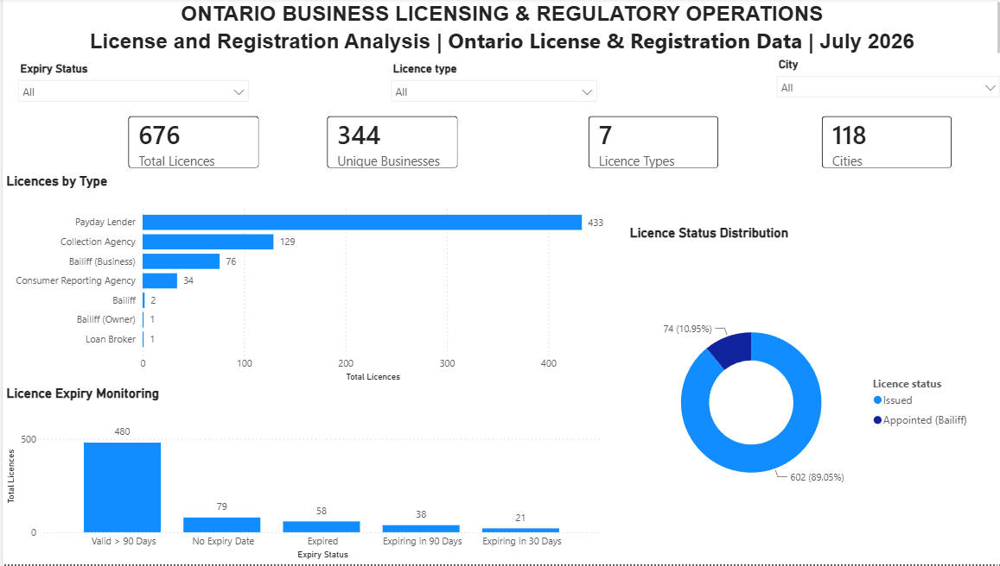
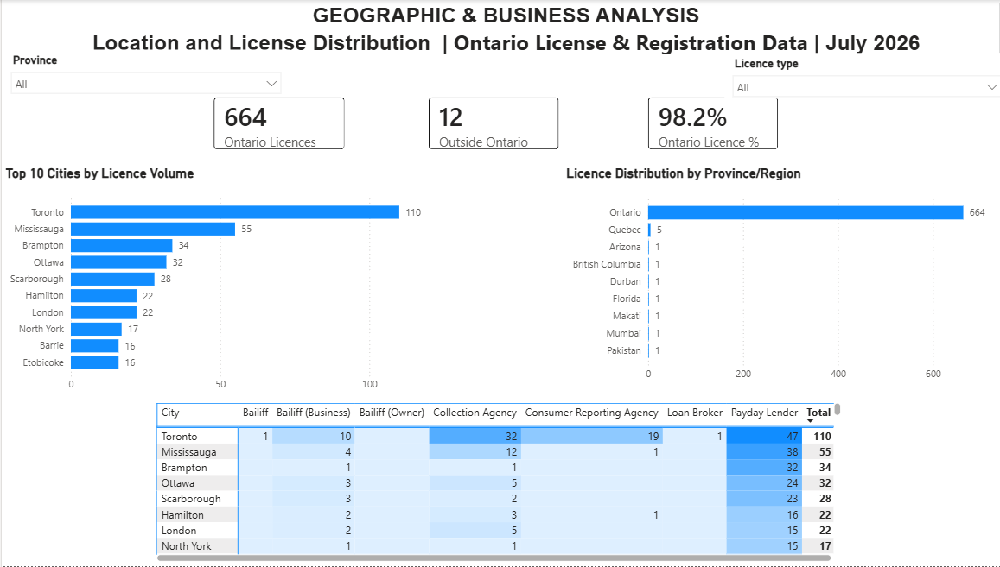
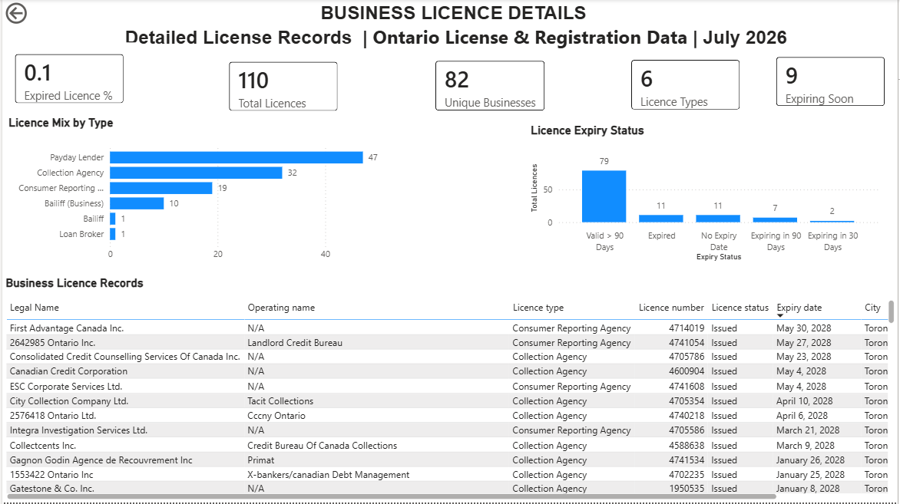

# Ontario Business Licensing & Regulatory Operations Dashboard

## Project Overview

This Power BI project analyzes publicly available Ontario business
licensing and registration data to provide insights into licence
distribution, geographic concentration, expiry status, and regulatory
operations.

The dashboard was developed as a portfolio project to demonstrate
Power BI, Power Query, DAX, data visualization, and operations
analytics skills.

## Dashboard Preview



## Dataset

Source: Ontario Data Catalogue - Select Licence and Registration Data
[Ontario Data Catalogue — Select Licence and Registration Data](https://data.ontario.ca/dataset/select-licence-and-registration-data)

Dataset snapshot: July 2026

The dataset contains 676 licence records representing 344 unique
businesses across 7 licence types and 118 cities.

## Dashboard Pages

### 1. Executive Overview

Provides high-level KPIs including:

- Total licence records
- Unique businesses
- Licence types
- Cities
- Licence distribution by type
- Licence status
- Licence expiry monitoring


### 2. Geographic & Business Analysis

Analyzes:

- Ontario vs. outside-Ontario licences
- Top cities by licence volume
- Province/region distribution
- City and licence-type concentration
- Interactive filtering



### 3. Business Licence Details

Provides city-level drill-through analysis including:

- Licence-level records
- Licence mix
- Expiry status
- Business information
- Detailed regulatory records



## Key Insights

- 676 licence records represent 344 unique businesses.
- 98.2% of licence records are associated with Ontario.
- Payday Lender is the largest licence category with 433 records.
- Toronto has the highest licence concentration among cities.
- Expiry monitoring identifies expired and soon-to-expire records
  for operational review.

## Power BI Features Used

- Power Query
- Data cleaning and transformation
- DAX measures
- Calculated columns
- KPI cards
- Interactive slicers
- Top-N analysis
- Conditional formatting
- Drill-through
- Matrix visualizations
- Operational monitoring

## DAX Measures

Examples of measures developed for this project:

```DAX
Total Licences =
COUNTROWS(BusinessLicences)

Unique Businesses =
DISTINCTCOUNT(BusinessLicences[Legal Name])

Ontario Licence % =
DIVIDE(
    [Ontario Licences],
    [Total Licences],
    0
)


Tools
Microsoft Power BI Desktop
Power Query
DAX
Ontario Open Data


Author
Madhvikaben Bhatt
